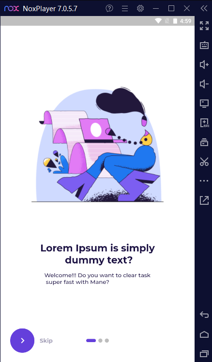

## Task Management App UI with Firebase Authentication and App state Restoration

Task Management app  Figma design is at (https://www.figma.com/file/pxd1UDP3s3054rfx1YFwWQ/Tasker---Task-Management-Apps-UI-Kits?type=design&node-id=175-1&t=8r7nHdoyUJfgCfS3-0)

## Project Description

 The app includes  designed UI screens, implemented authentication features, and app state restoration functionality. It leverages Firebase for authentication, Riverpod for state management, and Gorouter for routing.

## Features

- **Authentication:** Users can create an account, log in, and reset their password using Firebase authentication services.
- **App State Restoration:** The app supports state restoration, allowing users to seamlessly resume their tasks and app sessions after closing and reopening the app.
- **UI Screens:**  including authentication screens, Onboarding flow, splash screen, and a partially implemented dashboard, are provided as a starting point for further development.

## Screenshots
Preview                    |   Onboarding screen             |  Signup screen    |  Login screen    |  Dashboard screen    |  Create Workspace screen
:-------------------------:|:-------------------------:|:-------------------------:|:-------------------------:|:-------------------------:|:-------------------------:
|||||

## Created & Maintained By

[Naluswa256](https://github.com/Naluswa256)

